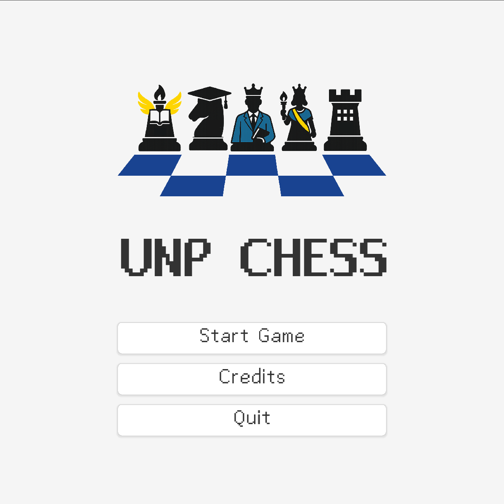
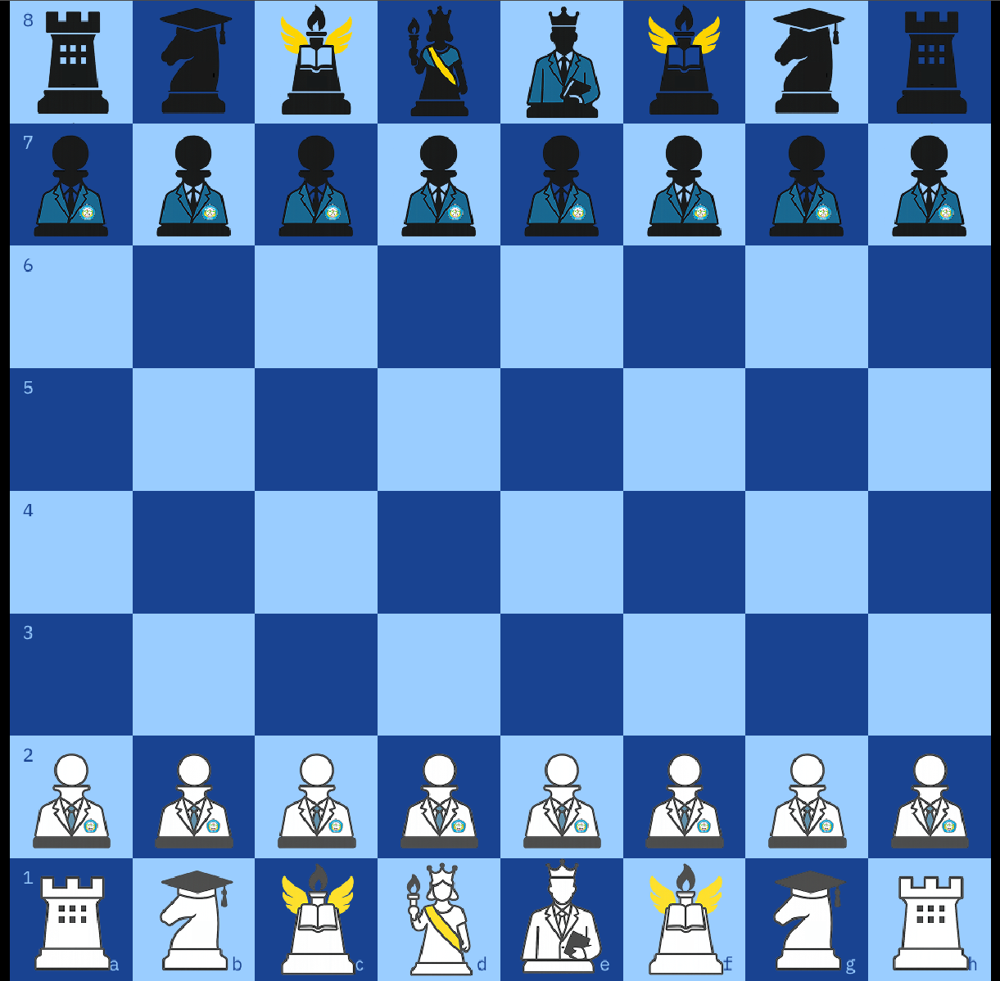

# UNP Chess

> Sebuah permainan catur klasik dengan antarmuka modern, dikembangkan menggunakan Godot Engine sebagai proyek akademis.

**UNP Chess** adalah sebuah game strategi 2D berbasis giliran yang mengadaptasi aturan catur internasional. Game ini dirancang untuk mode dua pemain lokal (_hot-seat_), di mana pemain dapat saling berhadapan dalam satu perangkat. Dengan antarmuka yang bersih dan visualisasi langkah yang jelas, game ini cocok untuk pemain dari semua kalangan. **Secara visual, game ini mengusung tema unik yang terinspirasi dari lingkungan akademis Universitas Nusantara PGRI Kediri, yang tercermin pada desain setiap bidak caturnya.**

---

## Fitur Utama

-   **Aturan Catur Lengkap:** Mengimplementasikan semua aturan standar, termasuk gerakan spesial seperti Rokade, Promosi Pion, dan En Passant.
-   **Mode Dua Pemain Lokal:** Dirancang untuk pertandingan _hot-seat_ yang kompetitif dan menyenangkan di satu komputer.
-   **Jam Catur Opsional (Game Clock):** Pemain dapat memilih untuk bermain dengan kontrol waktu (seperti **Blitz** dan **Rapid**) untuk menambah tantangan, atau bermain dalam mode **klasik tanpa batas waktu**.
-   **Visualisasi Langkah:** Sistem bantuan visual yang menyorot semua kemungkinan langkah legal saat bidak dipilih untuk membantu pengambilan keputusan.
-   **Deteksi Kondisi Permainan:** Mampu mendeteksi dan mengakhiri permainan secara otomatis saat terjadi Skakmat (_Checkmate_), Remis (_Stalemate_), atau **waktu habis**.
-   **Desain Antarmuka Modern:** Tampilan yang bersih, minimalis, dan intuitif dengan **tema visual UNP Kediri** agar pemain dapat fokus pada strategi.
-   **Umpan Balik Audio:** Efek suara yang responsif untuk setiap gerakan bidak dan kondisi akhir permainan.

---

## Screenshots

| Tampilan Menu Utama                 | Tampilan Permainan                    |
| :---------------------------------- | :------------------------------------ |
|  |  |

---

## Cara Bermain & Kontrol

### Alur Permainan

1.  Jalankan game, setelah _splash screen_ Anda akan masuk ke **Menu Utama**.
2.  Klik tombol **'Start Game'** untuk membuka pop-up pemilihan waktu.
3.  Pilih mode waktu yang diinginkan (contoh: '10 | 0 Rapid' atau 'Tanpa Waktu').
4.  Permainan dimulai! Pemain Putih jalan terlebih dahulu.
5.  Gunakan mouse untuk memilih dan menggerakkan bidak.

### Kontrol

-   🖱️ **Tombol Kiri Mouse:** Digunakan untuk semua aksi utama (menekan tombol, memilih bidak, dan menentukan petak tujuan).
-   `Esc` **Tombol Escape:** Digunakan untuk menjeda permainan dan menampilkan **Pause Menu**.

---

## Teknologi yang Digunakan

-   **Game Engine:** Godot Engine v4.2
-   **Desain Aset Visual:** Figma

---

## Tim Pengembang (Kelompok 2 - Kelas 3D)

Proyek ini dikembangkan sebagai bagian dari tugas akademis oleh **Kelompok 2** dari kelas **3D** Universitas Nusantara PGRI Kediri.

| Nama                                | Peran                                |
| :---------------------------------- | :----------------------------------- |
| **Yoga Firnanda Wicaksono**         | Desainer Game & Pimpinan Proyek      |
| **Muchammad Rafli Alfiasyah**       | Desainer Grafis (Artist)             |
| **Ichsan Azala Walanadza**          | Programmer                           |
| **Muhammad Andrian Bhakti Maulana** | Seniman Teknis (Programmer + Artist) |
| **Delia Saniar Komalasari**         | Komposer Musik                       |
